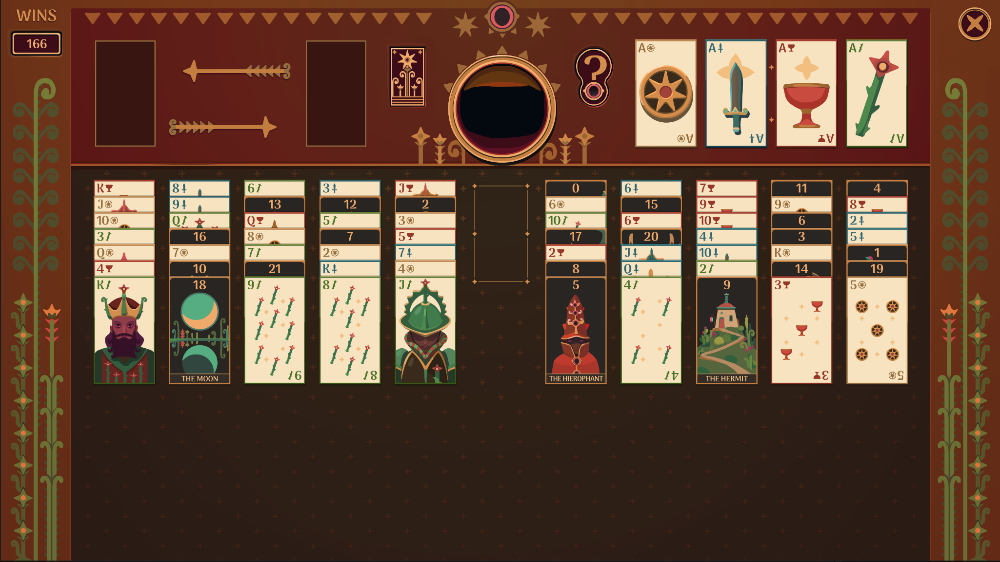

# FortuneSolitaireSolver
This is a simple solver for the Fortune Solitaire from The Zachtronics Solitaire Collection

The solver uses Depth First Search to explore the state and see if a final state can be reached.
I uploaded this mainly for educative purposes.

I always wondered if every initial state the game presents can be solved, so I made this to check.
Or when I get hardstuck if there is hope or I should stop wasting time.

You can get the game here: [Zachtronics](https://www.zachtronics.com/solitaire-collection/).

Screenshot of the initial game state

